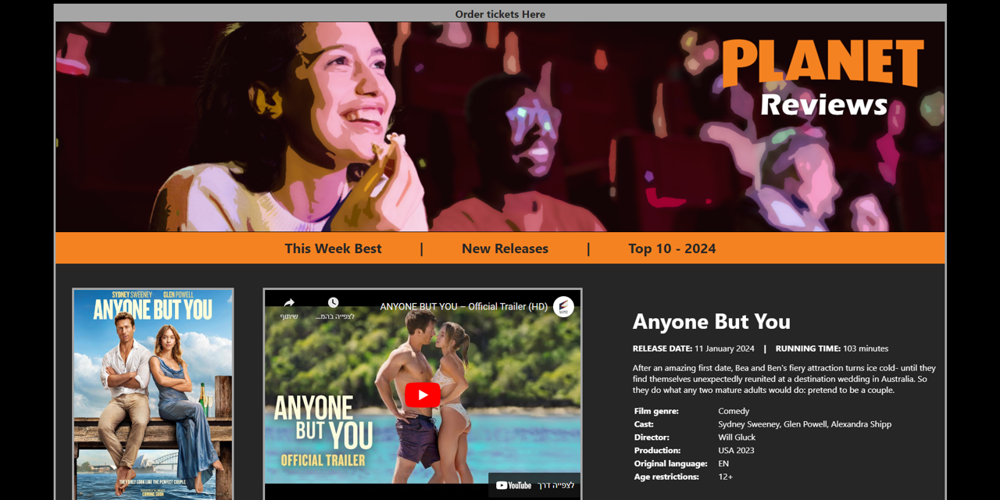
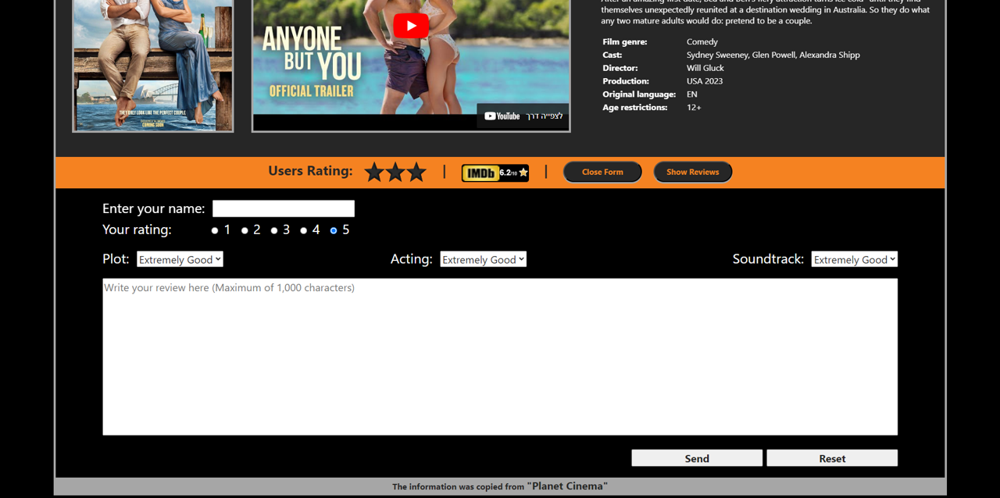
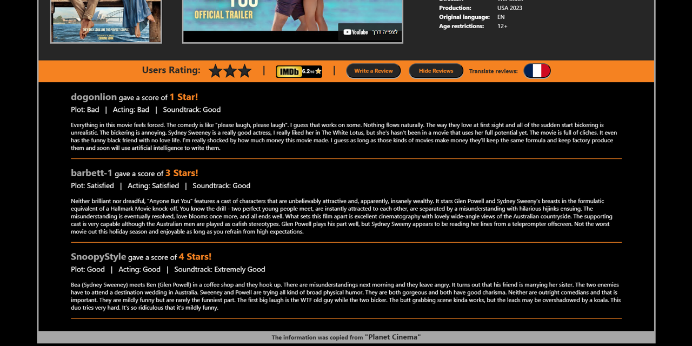

# 🌍 Planet Reviews

**Planet Reviews** is a single interactive web page for movie reviews, created by a team of 6 students as a final project in the **Software Architecture** course (Winter 2024).  
The page showcases a single movie as a functional prototype, allowing users to rate it, write reviews, and view IMDb information - all within a clean, responsive interface.

[🌐 Live Site](https://omer-matan-projects.github.io/Planet-Reviews/)

## ✨ Features

- ⭐ Star-based user rating system  
- 📝 Submit and read user reviews  
- 🎬 Watch the trailer via YouTube  
- 🌐 View IMDb score and link to the original movie page  
- 🌍 Multilingual review translation via **Google Translate API**  
  - Translation to English, French, German, and Italian is currently **disabled** due to the API's paid tier requirement.  
  - The integration was tested and works correctly when using a valid API key.  
- 🧩 Adapter design pattern used to abstract Google Translate API  
- 💾 Simulated database using `localStorage` - stores reviews and user selections locally

## 📸 Screenshots

### 🖥️ Main View

### 📝 Review Form

### 💬 Review Section

## 🛠️ Technologies Used

- **HTML**, **CSS**, **JavaScript**  
- Google Translate API (`axios.post`)  
- Adapter Design Pattern  
- `localStorage` to simulate database behavior (no backend or server used)  
- Entirely client-side - no installation or setup required

## 📁 Project Files

Inside the `docs/` folder you'll find:

- Project Description (Hebrew)  
- Project Presentation Slides  

These provide details on design choices, implementation, and challenges encountered.

## 🧪 Try It Out

👉 [Launch the page now](https://omer-matan-projects.github.io/Planet-Reviews/)

No setup needed - runs directly in the browser.

## 👥 Team Members

- Omer Lev  
- Matan Reuven Tal  
- Ariel Laniado  
- Sapir Gerstman  
- Ron Crispin  
- Ofir Dagan